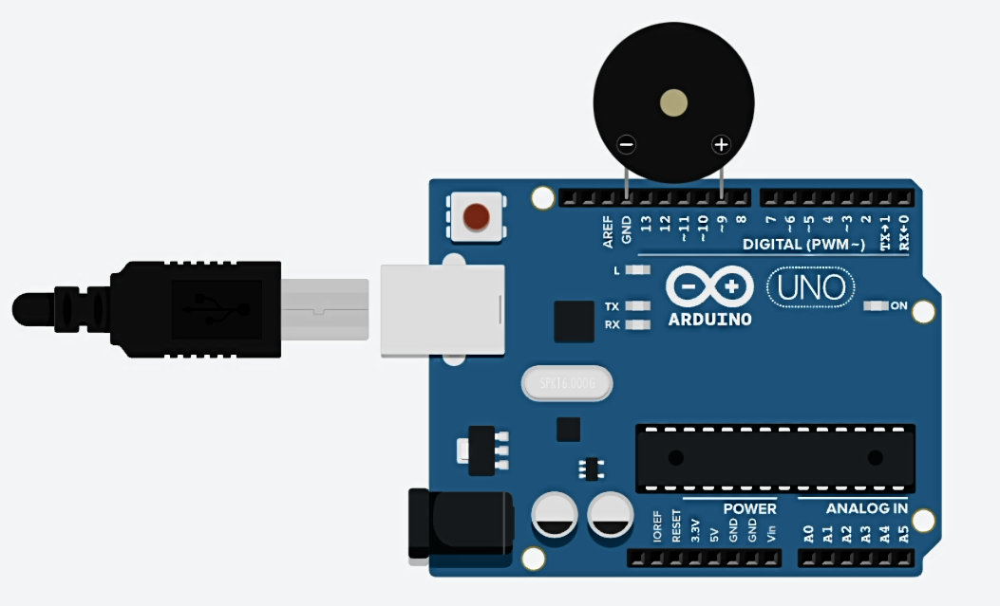

### [BACK](../../README.md)

## Circuit diagram


## Sketch

```c++
const int buzzer = 9;

void setup(){
  pinMode(buzzer, OUTPUT);
}

void loop(){
	tone(buzzer, 1000); //send 1kHz sound signal
 	delay(1000);
  	noTone(buzzer);
  	delay(1000);
}
```