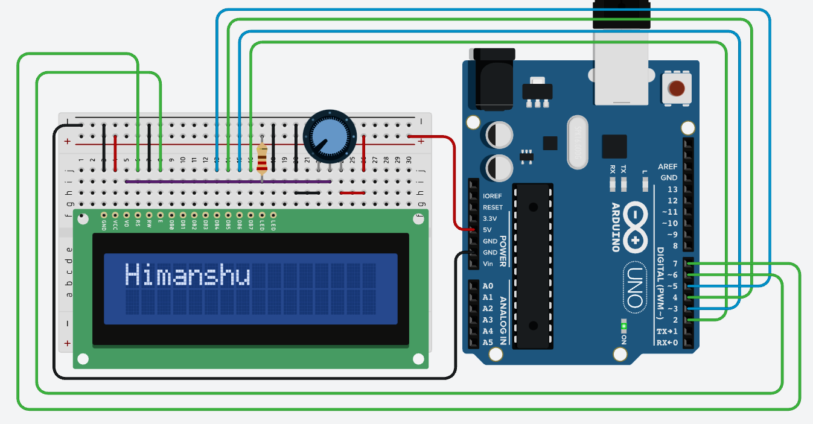

### [BACK](../../README.md)

## Circuit Diagram


## Components
- Arduino Uno R3 
- LCD 16x2 
- 10k ohm Potentiometer 
- 220 ohm Resistor 


## Sketch

```c
#include <LiquidCrystal.h>

// Defines the pins that are connected to the LCD display.
const int rs = 7, en = 6, d4 = 5, d5 = 4, d6 = 3, d7 = 2;

// Create an object of the LiquidCrystal class.
LiquidCrystal lcd(rs, en, d4, d5, d6, d7);

void setup() {
  // Initialize the LCD display.
  lcd.begin(16, 2);

  // Print the message on the LCD display.
  lcd.print("Himanshu");
}
void loop() {

}
```


- LCD RS pin to digital pin 12
- LCD Enable pin to digital pin 11
- LCD D4 pin to digital pin 5
- LCD D5 pin to digital pin 4
- LCD D6 pin to digital pin 3
- LCD D7 pin to digital pin 2
- LCD R/W pin to GND
- LCD VSS pin to GND
- LCD VCC pin to 5V
- LCD LED+ to 5V through a 220 ohm resistor
- LCD LED- to GND
