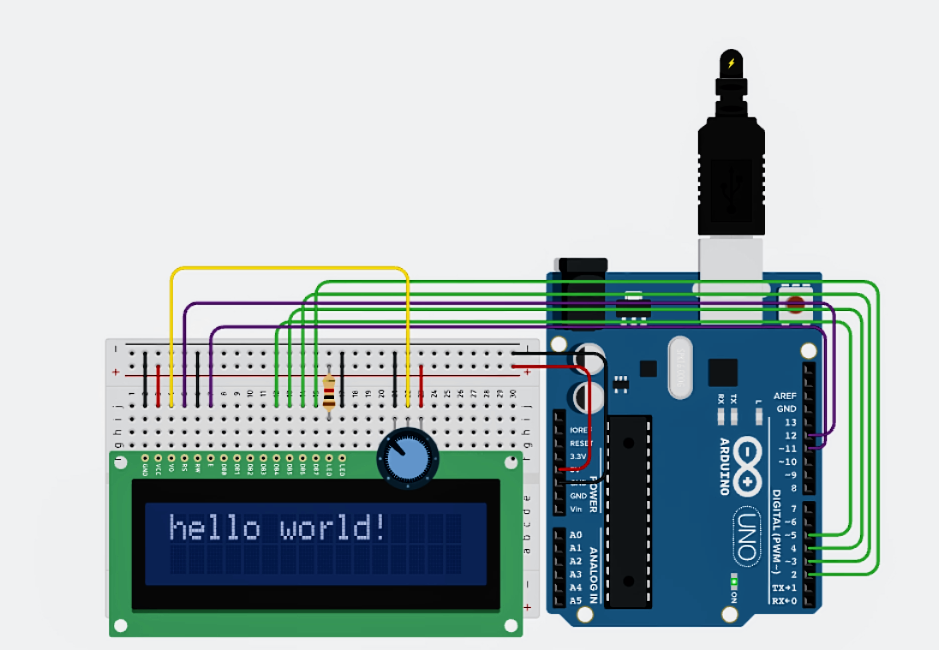

# Arduino sketch for LCD

## Circuit Diagram


## Sketch
``` c
#include <LiquidCrystal.h>

const int rs = 12, en = 11, d4 = 5, d5 = 4, d6 = 3, d7 = 2;
LiquidCrystal lcd(rs, en, d4, d5, d6, d7);

void setup() {
  lcd.begin(16, 2);
  lcd.print("Hello World!");
}

void loop() {
  
}
```
- LCD RS pin to digital pin 12
- LCD Enable pin to digital pin 11
- LCD D4 pin to digital pin 5
- LCD D5 pin to digital pin 4
- LCD D6 pin to digital pin 3
- LCD D7 pin to digital pin 2
- LCD R/W pin to GND
- LCD VSS pin to GND
- LCD VCC pin to 5V
- LCD LED+ to 5V through a 220 ohm resistor
- LCD LED- to GND
