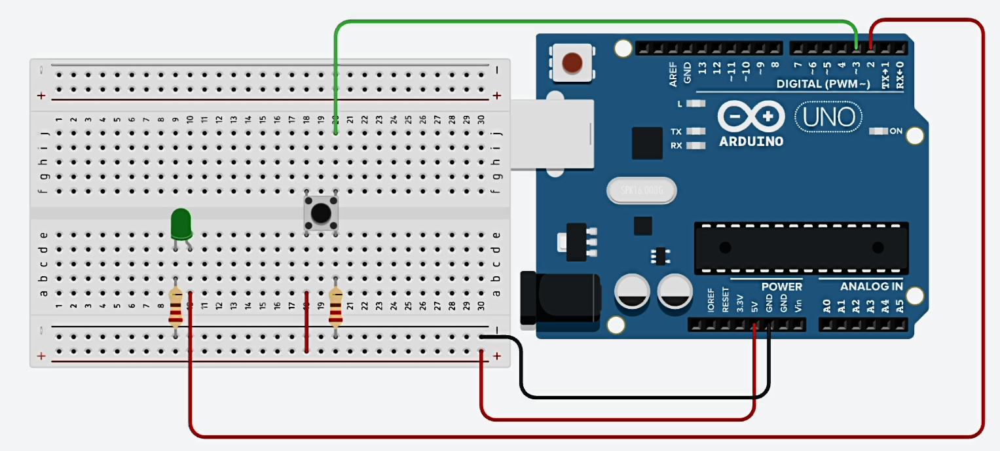

## Circuit diagram


## Components
- Arduino Uno R3
- LED
- Push button
- 220 ohm Resistor x 2


## Sketch

```c
const int led = 2, button = 3;
void setup(){
	pinMode(led, OUTPUT);
  	pinMode(button, INPUT);
}
void loop(){
  if(digitalRead(button) == HIGH){
	digitalWrite(led, HIGH);
  }
  else{
   	digitalWrite(led, LOW); 
  }
}
```