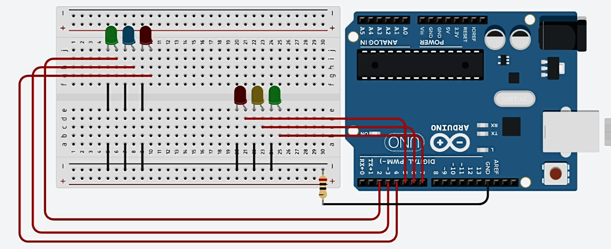

## Circuit diagram


## Components
- Arduino Uno R3
- 220 ohm resistor
- LED x 6


## Sketch
```c
const int led1 = 2, led2 = 3, led3 = 4;
const int led4 = 5, led5 = 6, led6 = 7;
int t = 1000;

void setup(){
	pinMode(led1, OUTPUT); 
  	pinMode(led2, OUTPUT);
  	pinMode(led3, OUTPUT);
  	pinMode(led4, OUTPUT); 
  	pinMode(led5, OUTPUT);
  	pinMode(led6, OUTPUT);
  
 	Serial.begin(9600);
}

void loop(){
  for(int i = 2; i<8; i++){
   	digitalWrite(i, HIGH);
    delay(t);
  }
  for(int i = 7; i>1; i--){
    digitalWrite(i, LOW);
    delay(t);
  }
}
```